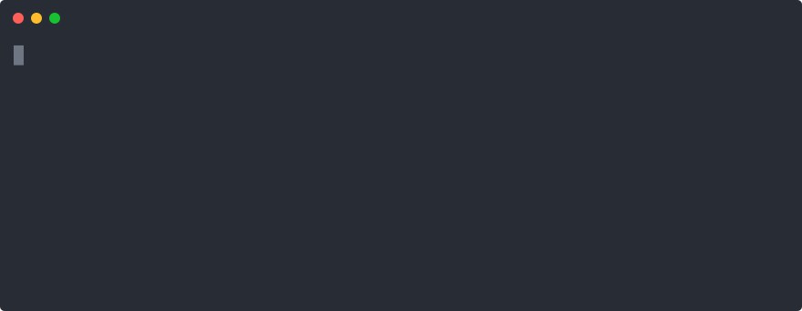

# foundry

Reusable CI workflows, `mise` task templates and config presets behind six commands, so the same checks run while an agent edits, before you push, and on the PR.

## Why I built it

When an AI coding agent (or a person) changes code, the checks that decide "is this good enough?"
usually live in several places that disagree. The editor, a pre-push hook and CI each run
different tools with different settings. You get work that passes locally and fails on the
pull request, and agents that fix one complaint only to trigger another.

Foundry gives every repo the same small set of commands (`fix`, `lint`, `typecheck`, `test`,
`audit`, `gate`) backed by one shared configuration, so the exact same checks run while code is
being written, before it's pushed, and in CI. It also stops existing technical debt from growing:
known problems go into a baseline that's allowed to shrink but never grow.



The agent half (skills and hooks) lives in [cmaintz-skills](https://github.com/CMaintz/cmaintz-skills). The seam between the two repos is [CONTRACT.md](./CONTRACT.md), which is copied into both.

If you want the long version, [OVERVIEW.md](./docs/OVERVIEW.md) walks through how the gates, habit sensors, skills and the `learn` loop fit together. [FEATURES.md](./docs/FEATURES.md) is the full inventory of what Foundry provides, and doubles as my backport checklist: anything non-language-specific I build in a consumer repo comes back here.

## The idea

A CI pipeline and a set of agent habits usually get built as two separate things. I think they should be one rule set, placed in three spots:

| Placement | When | Feedback to | Cost |
|---|---|---|---|
| In-loop | while the agent edits | the agent, mid-task | free, already in session |
| Pre-push | before code leaves the machine | you | free |
| CI | on pull request | the permanent record | free tier |

Run different rules in each and you get "passes locally, fails in CI", plus a failure mode specific to agents: the agent fixes what the hook reported, CI complains about something else, the agent fixes that and breaks the first thing again.

## The verbs

```bash
mise run fix        # auto-fix what is mechanically fixable
mise run lint       # style + structural smells
mise run typecheck  # static types
mise run test       # tests + coverage floor
mise run audit      # vulnerabilities, secrets, SAST
mise run gate       # all of the above, in order. The oracle.
```

Callers invoke verbs, never tools. That's what lets one skill library serve a Kotlin repo and a React repo. Full rules are in [CONTRACT.md](./CONTRACT.md).

## Using it in a repo

The quickest way is the scaffold. It copies the templates and presets, generates the caller workflows, and prints a branch-protection checklist:

```bash
curl -fsSL https://raw.githubusercontent.com/CMaintz/foundry/main/scripts/foundry-init.sh -o foundry-init.sh
bash foundry-init.sh java        # stacks: ts | java | php | kotlin | dotnet | python
```

Or wire it by hand: a `mise.toml` with the six verbs (templates in [mise/](./mise/)) plus a caller workflow that pins the facade and passes your stack:

```yaml
# .github/workflows/gate.yml
jobs:
  gate:
    uses: CMaintz/foundry/.github/workflows/gate.yml@v2
    with:
      stack: java              # ts | java | php | dotnet
      working_directory: "."   # monorepo? call this job once per package
```

### The public API: two facades

Pin these two, whatever your stack. They dispatch internally to the per-stack workflows, so the files you pin don't change when I add a stack or rename an internal. Require their `*-ok` aggregate checks in branch protection.

| Facade | What it runs | Key inputs |
|---|---|---|
| [`gate.yml`](./.github/workflows/gate.yml) | the language gate (the six verbs, one step each, with fix summaries) plus structural smells; Java adds an opt-in `spotbugs` job | `stack` (ts/java/php/dotnet), `working_directory`, `spotbugs` |
| [`security.yml`](./.github/workflows/security.yml) | language-agnostic: secret scan, `ruleset-guard` and diff-aware SAST | `ruleset_paths`, `source_paths`, … |

Other reusable workflows you call directly:

| Workflow | What it runs |
|---|---|
| `web.yml` | max-file-length check for HTML/CSS |
| `bootstrap.yml` | regenerates the habit-hooks snooze baseline on Linux and opens a PR |
| `ratchet-report.yml` | PR comment showing how the accepted-debt baselines moved |
| `autofix.yml` | label a PR `autofix` and it runs `mise run fix`, then commits and pushes the result |

The `_`-prefixed workflows (`_java.yml`, `_ts.yml`, `_php.yml`, `_dotnet.yml`, `_guards.yml`, `_semgrep.yml`) are the facades' implementation. Don't pin them directly; they can change between minor versions.

On the consumer side, split the callers into separate files (`gate.yml`, `security.yml`, `bootstrap.yml` and so on) rather than one big `ci.yml`. [OVERVIEW.md](./docs/OVERVIEW.md) §13 explains why.

### Presets

Shared config and agent-facing docs. The scaffold copies them in, and the docs can also be `@`-included straight into your `AGENTS.md` / `CLAUDE.md`:

| Preset | What |
|---|---|
| [`habit-hooks/<stack>.toml`](./presets/habit-hooks/) | structural-smell config per stack, with tests excluded and the language-independent `generic` duplication check everywhere ([details](./presets/habit-hooks/README.md)) |
| [`habit-hooks/java/guides/`](./presets/habit-hooks/java/guides/) | per-smell coaching for the Java sensor: a concrete "fix toward this", shown both in-loop and in CI |
| [`pmd/ruleset.xml`](./presets/lint/pmd/) · `pmd/no-var.xml` | tuned Java ruleset (`ExcessiveParameterList` ≥ 8) plus a no-`var` rule |
| [`typecheck/tsconfig.json`](./presets/typecheck/tsconfig.json) | strict, check-only tsconfig for the `ts` stack, covering src, scripts and tests. The `ts` template's `typecheck` refuses to run without a tsconfig, and checks Deno code (Supabase Edge Functions) with `deno check` via `FOUNDRY_DENO_PATHS` |
| [`gitleaks.toml`](./presets/security/gitleaks.toml) · [`renovate.json`](./presets/renovate.json) | a starting secret-scan allowlist, and the dependency-update path that "pin everything" needs |
| [`code-standards.md`](./presets/agent/code-standards.md) · [`collaboration.md`](./presets/agent/collaboration.md) · [`agent-loop.md`](./presets/agent/agent-loop.md) | standing docs for agents: clean code (functions do one thing), working discipline (branch hygiene, sub-agents), and the self-correcting loop (observe, fix the cause, verify, repeat until it's green *and* honest) |
| [`ticket-schema.md`](./presets/tickets/ticket-schema.md) · [`ISSUE_TEMPLATE/agent-feature.yml`](./presets/tickets/ISSUE_TEMPLATE/agent-feature.yml) | the GitHub Issue format the `/feature` driver works from: intent, an acceptance-criteria checklist, scope, pointers. Copy the template into your repo's `.github/ISSUE_TEMPLATE/` |

### From ticket to PR with `/feature`

Foundry answers "when is a change done?" with a green gate. The `/feature` driver sits in front of that: ticket in, PR out. It's the [`feature`](https://github.com/CMaintz/cmaintz-skills) skill in cmaintz-skills, specified in [designs/backlog-feature-driver.md](./docs/designs/backlog-feature-driver.md). Foundry ships the ticket format it reads (the schema and issue template above). The driver:

1. Claims an `agent:ready` ticket (a GitHub Issue on the [`agent-feature`](./presets/tickets/ISSUE_TEMPLATE/agent-feature.yml) form, see the [schema](./presets/tickets/ticket-schema.md)) and flips it to `agent:working`, one at a time, in its own worktree off `origin/main`.
2. Loops against the gate: implement, `mise run gate`, act on the failure and the habit-hooks coaching, retry. It's capped at 5 cycles and bails early if it stops making progress, posting where it got stuck to the issue and flipping it to `agent:blocked`.
3. Checks the result against the ticket's acceptance criteria, because green doesn't mean correct.
4. Hands off to `/ship`, which re-runs the gate, does a fresh-context review against the linked issue, commits, and opens the PR. The driver never opens a PR itself, so there's one trusted path to `main`.

It doesn't re-implement any of the standards. The gate is the oracle, `ruleset-guard` and habit-hooks stop the loop from gaming the metric, and `/ship` does the handoff. Run it supervised with `/feature <ref>`, or as a backlog puller with `/loop <interval> /feature`.

### Versioning

Foundry follows semver on the reusable-workflow interface (workflow inputs and the
six-verb contract, not the internal steps):

- patch (`v1.0.1`): a fix with no interface change.
- minor (`v1.1.0`): a backward-compatible addition, like a new workflow, a new
  optional input or better feedback.
- major (`v2.0.0`): a breaking change, like a renamed or removed input, a verb that
  means something new, or a dropped workflow. This is the only case where you need to act.

I tag at milestones (a batch of merged PRs), not on every commit. Each release gets an
immutable `vX.Y.Z` tag and the `vX` alias moves to it, so pinning `@v2` picks up
non-breaking updates while `@v2.4.0` stays frozen. Pin by SHA for maximum
reproducibility (Renovate bumps it) or by `@v2` for convenience. `CHANGELOG.md` records
what each tag moved.

Releases are one command from a clean `main`:

```bash
bash scripts/cut-release.sh minor      # or major | patch | X.Y.Z  (--dry-run to preview)
```

It reads the current version from the latest tag (the only source of truth), builds the
`CHANGELOG` section from the conventional commits since that tag, tags and pushes, creates
the GitHub release and moves the `vX` alias. It refuses a non-major bump if it finds a
breaking commit, so semver can't quietly slip. This replaced release-please, whose separate
manifest could drift out of sync with the tags.

## Design

Two ideas do most of the work.

Deterministic tools decide; models only propose. Linters, type checkers, tests and scanners decide pass/fail. A model produces a patch, and the patch is accepted only if the deterministic gate then passes. A model saying it fixed something isn't evidence. The exit code is.

Ratchet, don't gate. Bolt linters onto a real codebase and everything is red on day one, so you give up in week two. Instead, record the existing violations as a baseline that can only shrink. ESLint 9.24+ (`--suppress-all` / `--prune-suppressions`) and habit-hooks (`habit-snooze`) both support this out of the box, so there's no need to hand-roll it.

That only works if the baseline can't be quietly loosened, so it's enforced: a PR that changes the ruleset *and* production code fails `ruleset-guard` unless a human labels it `ruleset-change`. Otherwise the cheapest fix for `high-complexity` would always be `// eslint-disable-next-line`.

Full rationale: [DESIGN.md](./docs/DESIGN.md).

## Status

TypeScript and Java are the proven stacks (Java through the AutoApplicant pilot: Spring Boot, Angular and a browser extension). PHP and .NET also have gate workflows behind the facade. Kotlin and Python have verb templates and presets but no CI workflow yet. DESIGN.md §10 covers the rollout and §11 what's still open.

## Licence

MIT.
